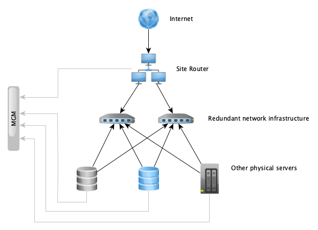
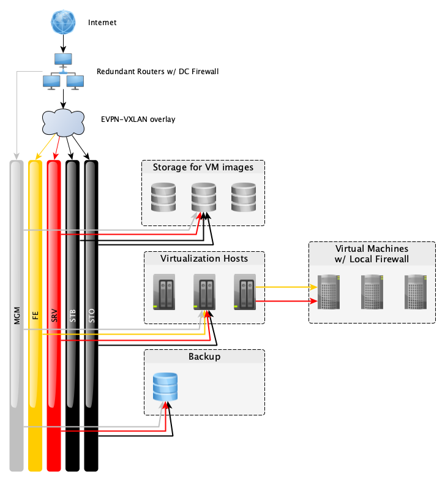

% last review: 2026-04-23

% review schedule: 1 year

% ISMSControl: A.13.1.3
% ISMSControl: 8.22

# Overview { #networking-overview }

## Physical networks

We use a redundant routed layer 3 network as the basis of production network
functions in all our public datacenters. All of our servers in each location are
connected to redundant network infrastructure, which forwards network traffic
between the servers. This redundancy allows maintenance actions or failures of
individual network devices without customer impact.

On top of this routed network we use an overlay technology called EVPN-VXLAN,
which allows us to run multiple logically separate layer 2 or layer 3 networks
over shared physical infrastructure. All of our logical networks aside from the
out-of-band management network are implemented as virtual networks running
through this overlay.

The management network uses separate physical infrastructure and is implemented
as a simple flat layer 2 network using dedicated switches.

In all locations, the routed layer 3 network carrying production traffic uses
links of at least 10G, which is available to all the virtual networks running on
top of the overlay. In our public datacenter RZOB both routers each have 10G
connectivity to our uplink provider. In WHQ our routers each have a 10G link to
our uplink provider, however this provider only has *non-redundant* 3G
connectivity itself.

The routers participate in the EVPN-VXLAN overlay, having access to the frontend
network and server-to-server network, and are additionally connected to the
management network.

## Logical networks { #logical-networks }

Our logical networks can be implemented as either layer 2 VLANs or virtual
networks inside an EVPN-VXLAN overlay due to a unified internal numbering
scheme. All networks use layer 2 transport unless otherwise noted. We have the
following logical networks in use:

**MGM** - Management, purely for administrative purposes. This network connects
switch management ports, baseband management controllers, and additional access
to server OSes via SSH. Not accessible from the outside world, private IPv4
address space.

**FE** - Frontend, for customer application traffic. This network connects to
managed machines that provide customers' application to the public. This network
is switched to the VM and leverages completely public traffic. The DC firewalls
do not filter this, however the default system firewall running locally on
managed VMs blocks inbound connections. Customer applications are free to use
any ports they like. These ports must be listed in the firewall configuration in
order to receive inbound connections. All managed VMs receive a NIC on this
network but not necessarily IPv4 or IPv6 addresses if they do not provide public
services. DNS example: *vm00.fe.rzob.fcio.net*.

**SRV** - Server to server communication. Used for customer application
components running in managed VMs to talk to each other, e.g. database traffic
and for management purposes on the application level. This network is firewalled
from the internet at our DC edge firewalls and allows only HTTP(S) and SSH
traffic. Additionally, managed VMs can filter this traffic locally, and only
allow arbitrary traffic from VMs belonging to the same project by default. This
network is used on all managed VMs and has IPv4 (usually private) and IPv6
addresses allocated automatically. DNS example: *vm00.srv.rzob.fcio.net* or
simply *vm00.fcio.net*.

**PUB** - Public, for traffic to unmanaged VMs. Unmanaged VMs which are not
running our managed platform receive a NIC on this network and public IPv4 and IPv6
addresses in order to provide general access to and from the internet. This
network uses a layer 3 transport, and is not firewalled. Unmanaged VMs do not
come with a preconfigured local firewall – if such a firewall is desired then
customers must configure this themselves. DNS example: *vm00.pub.rzob.fcio.net*

**STO** - Storage communication. Used by the virtualization and backup servers
to access the network storages where the VM disk images as well as object
storage gateways (RadosGW) are located. DNS example:
*filer.sto.rzob.gocept.net*.

**STB** - Storage backend communication. Used by the storage layer for
replication and self-management. DNS example: *filer.stb.rzob.gocept.net*.

Individual VMs that run management services, like monitoring, may get bridged
into additional networks or granted firewall exceptions as necessary.

The routers suppress "martian" traffic which is on the wrong VLAN,
e.g. frontend traffic injected on the server-to-server network or private
addresses from the internet.

## Local ports

Your application is generally free to use any open port on a machine
above 1024. Especially if you run a component that has a registered, well-known
port, please use that.

However, custom applications may run into the trouble of colliding with other
components. For that we guarantee that the ports 61000-61999 will never be used
by our managed components, nor by the kernel when assigning dynamic ports.
