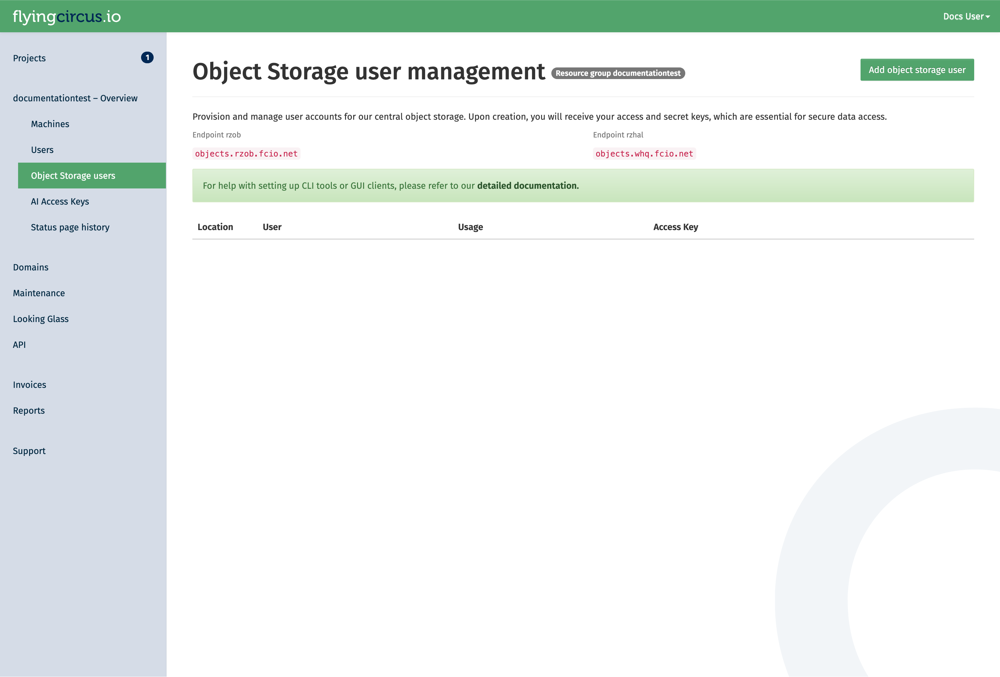
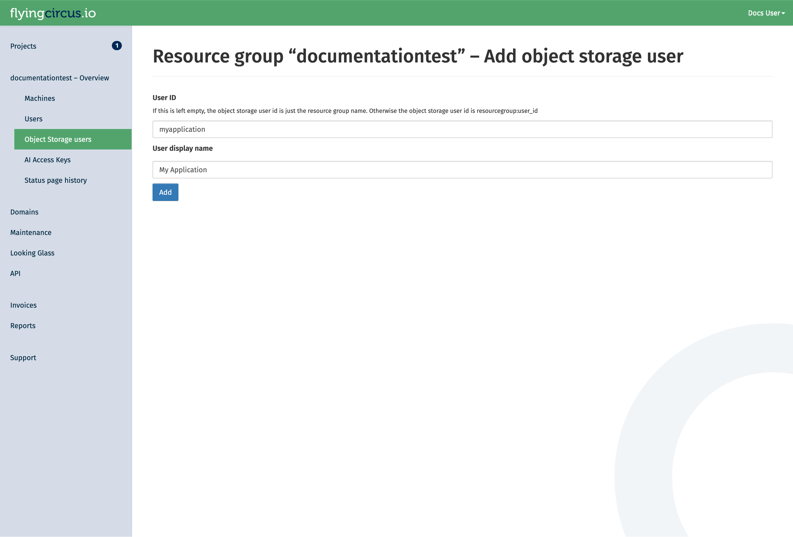
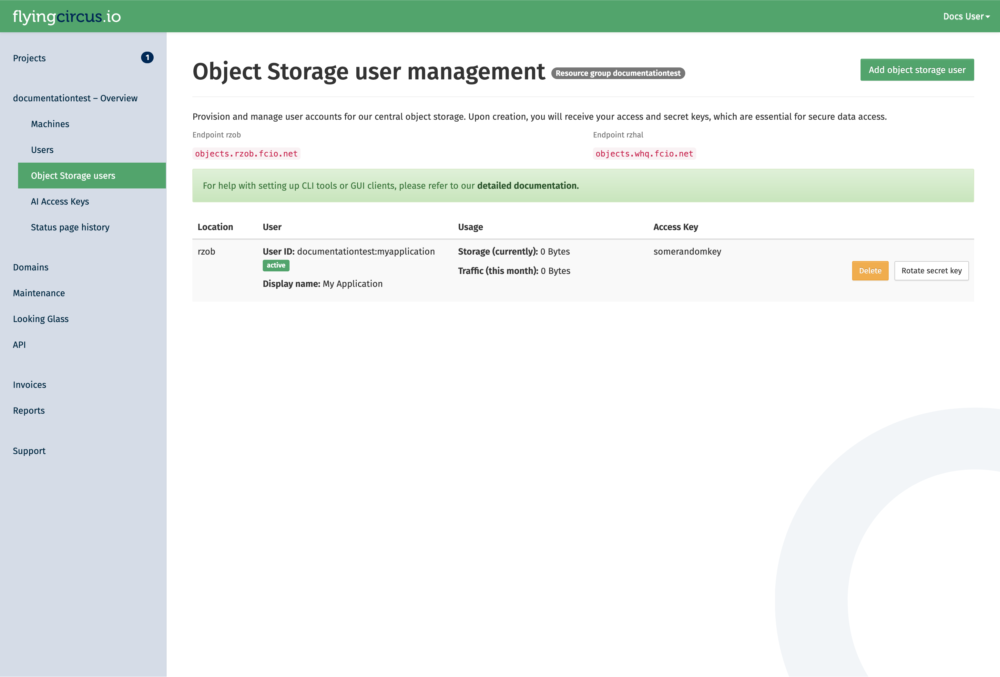

# S3-compatible Object Storage { #storage-objects }

Our Ceph cluster also provides an S3-compatible object storage.
The data in the cluster is transparently encrypted before being stored onto
physical disks, see [data-at-rest-encryption](../security/data-protection.md#data-at-rest-encryption) for details.

## Creating users

Object storage users are managed in our customer portal at [my.flyingcircus.io](https://my.flyingcircus.io) in the "Object Storage users" page of each resource group.



Click the "Add Object Storage user" button to create a new user. *manager* permission is required for this.

The user id is a suffix appended to the resource group name. It can be used when there are multiple applications in one resource group which should not have access to each others data. The display name is for your discretion to explain the use of the user. If left empty, it defaults to the user id.



You will be redirected to a page that shows the secret key of the user.
Secret keys of a user are shown only once. If you loose the secret key, you can rotate the key in the customer portal.
However, this will invalidate the old secret key!

After a user is created (or the secret is rotated), allow up to 10 minutes for it to be synchronized with the cluster.
You can see the current status of the user in the portal.
While the status is pending, it the user will not be available:


As soon as the status changes to active, it can be used.



## Access the object storage

After the user is active, you can connect to the storage using the corresponding access key and secret key.

The endpoint for our public object storage services follows the pattern `https://objects.<location>.fcio.net`.
If you have an on-premise deployment, you will have set up a custom endpoint. If you are unsure, ask your project contacts for the endpoint details in your case.

Our public data center endpoints are:

* RZOB (production): `https://objects.rzob.fcio.net`
* RZHAL/WHQ (secondary, offsite): `https://objects.whq.fcio.net`

You can see the data center associated with your key in the table in our portal.

With your user, you can create buckets via the S3-compatible API and use it for other operations.

!!! note
    Because of incompatibilities due to changes from AWS in their original S3 clients, the following options need to be set
    in your client config:

    ```
    request_checksum_calculation=when_required
    response_checksum_calculation=when_required
    ```

### Getting started

Here are some examples how to interact with our cluster with `awscli2`.

#### Setup the configuration

1. Create the file `~/.aws/config` with the following content. This ensures compatibility with our object storage implementation.

```
[default]
request_checksum_calculation=when_required
response_checksum_calculation=when_required
```

2. Create the file `~/.aws/credentials` with the following content.
Adjust the access key and secret key with the values presented to you when you created the user.
Also adjust the endpoint if your object storage user is in a different location.

```
[default]
endpoint_url=https://objects.rzob.fcio.net
aws_access_key_id=displayed_access_key
aws_secret_access_key=displayed_secret_key
```


#### Create your first bucket

With the following command you can setup your bucket in our object storage cluster.
Please note that the bucket name must be unique in the cluster.
Read [our guideline for naming buckets](#object-storage-global-bucket-namespace) to avoid surprises with name collisions by other clients.
 
```
aws s3api create-bucket --bucket mybucketname-23123
```

Now you can use the object storage and store files in it.


## Deletion

When an object storage user is deleted, all its owned buckets are also deleted in a multi-stage process that takes around 20 days.

The stages of deletion are:

Soft

: (at t=0)

  Revoke access keys. Acccess to the user and it's buckets is no longer possible.

  At this point you can still cancel the deletion. A new secret key is then generated.

Hard

: (t+14 days)

  Delete the object storage user and all owned buckets.

Recycle

: (t+20 days)

  Delete the object storage user deletion notice which will allows the object storage user id to be reused. 

## Application Implementation Guidance

Object storages are flexible and scalable without having to worry too much
how they store the data. However, long term experience shows that a few rules
should be respected when implementing object storage in your application
to avoid problems later on and increase compatibility with third party
applications.

### Store the object locations in your application's database

The best investment you can make when starting (or evolving) your usage of object storage
your application is to store the specific bucket and object key in
your application's database together with the main object record. If you have a
table like "documents" then store your IDs like this:

```
ID      | object  | ... application data ... | s3uri
--------+---------+--------------------------|-----------------------------------------
5       | preview | ...                      | s3://myapp-2022-76fb4d2/preview/5.jpg
298376  | preview | ...                      | s3://myapp-2023-45df511/preview/298376.jpg
```

This allows you to later decide for a different organization scheme and change your application's code that generates those bucket names and object keys without having to immediately update your database or keep multiple generations of key generation code alive.

You can then write a (slow) migration script that checks all objects whether their bucket and id is still the one that your application would generate now and if it is not you can copy the object, update the database and delete the old object, to perform a no-downtime migration.

### Organize your objects using prefixes (use /pictures/1234.jpg instead of picture1234.jpg)

Theoretically you can grow bucket sizes almost infinitely and just throw objects
into it without any structure. However, S3 supports something resembling a file
hierarchy within a bucket by putting forward slashes ("/") into the key names.
This helps utilities that need to list keys because the API allows to
efficiently retrieve those listings by providing a search prefix. The "/" is a
common delimiter that many tools (like rclone) can automatically recognize and
use.

See details about using prefixes in S3 in the original documentation
(https://docs.aws.amazon.com/AmazonS3/latest/userguide/using-prefixes.html). Be
aware that key lengths must be shorter than 1024 bytes!

Within a bucket your could use a "per client" and/or "per type" hierarchy, e.g. "<customer>/<type>/<objectid>" that would result in "acme/pictures/1234.jpg".

An alternative sharding criterion if your data does not have a native hierarchy
is to extract a prefix from within the name. If your data has some randomness
early in the filename then you could create an additional sharding layer.
Consider this list of files:

```
11-8999103.pdf
11-8999103.thumbnail.png
11-8999424.pdf
11-8999424.thumbnail.png
11-8999777.pdf
11-8999777.thumbnail.png
11-9000018.pdf
11-9000018.thumbnail.png
11-9000025.pdf
11-9000025.thumbnail.png
11-9000370.pdf
11-9000370.thumbnail.png
11-9000371.pdf
```

Which could be organized with the first 5 characters as a sharding layer:

```
.
├── 11-89
│   ├── 11-8999103.pdf
│   ├── 11-8999103.thumbnail.png
│   ├── 11-8999424.pdf
│   ├── 11-8999424.thumbnail.png
│   ├── 11-8999777.pdf
│   └── 11-8999777.thumbnail.png
└── 11-90
    ├──  11-9000018.pdf
    ├──  11-9000018.thumbnail.png
    ├──  11-9000025.pdf
    ├──  11-9000025.thumbnail.png
    ├──  11-9000370.pdf
    ├──  11-9000370.thumbnail.png
    └──  11-9000371.pdf
```

If your data does not have sufficient randomness in this way you can generate a
sharding layer by hashing your filenames and using the first few characters:

```
>>> import hashlib
>>> print(hashlib.sha256("11-9999991.thumbnail.png").hexdigest()[:2])
'72'
>>> print(hashlib.sha256("11-9999991.pdf").hexdigest()[:2])
'89'
```

This would result in the following sharding structure that distributes quite evenly on the first layer:

```
.
├── 40
│   └──11-9000370.pdf
├── 54
│   └──11-8999777.thumbnail.png
├── 59
│   └──11-9000025.pdf
├── 80
│   └──11-8999424.thumbnail.png
├── 84
│   └──11-9000018.thumbnail.png
├── 89
│   └──11-9000370.thumbnail.png
├── 99
│   └──11-9000018.pdf
├── 9b
│   ├──11-8999424.pdf
│   └──11-8999777.pdf
├── a3
│   └──11-9000025.thumbnail.png
├── c8
│   └──11-8999103.pdf
├── de
│   └──11-8999103.thumbnail.png
└── df
    └──11-9000371.pdf
```

### Be aware of the global bucket namespace (suffix your buckets with short uuids – "app-2022-d7b54fd") { #object-storage-global-bucket-namespace }

S3 considers the bucket namespace to be global "within a partition". This means
that you must not rely in specific bucket names to be available to your
application. See Amazon's "Buckets overview" for more information.

Our recommendation is to use a combination of your applications name, the
sharding criteria and a short random uuid (7 hexdigits) and be prepared to
regenerate the random uuid if it already exists but was created by another
account. Examples of good bucket names:

```
myapp-2022-76ba5dd
myapp-cust1-54fdb32
```

Due to the inclusion of a random uuid you will also need to store the specific
bucket names that you have created in your application's database for certain
purposes, like ("this year's bucket for customer X is
named "myapp-X-2022-54fdb32").

### Limit total bucket size (organize buckets with "app-2022" or "app-customer1")

Another layer to make things more manageable is to create new buckets to
restrict a single bucket's total size (number of objects and data size). In
general you should not have a lot of buckets. It's fine to have large buckets
as long as you organize them as shown above. However, two reasons exist to
split your data into multiple buckets: failure domain and customer data
separation requirements.

Buckets are a failure domain in the sense that they maintain an internal index.
If this index becomes corrupt (which happens very rarely but has happened due
to bugs in the past) you need to rebuild the bucket based on your applications
data and copy the data to a new bucket. This can become extremely expensive and
slow (think: days or weeks) and may block other operations that rely on the
index (like backups) while rebuilding.

Also, if your customer requires a high level of data separation then it might be
reasonable to create a bucket per customer.

In general our recommendation is: if you don't have a per-customer separation
requirement, then default to splitting your buckets on a time basis, if you
don't know better, then create a new bucket every year.

Amazon hints that their default limit for number of buckets per customer is 100,
so creating a bucket structure that ends up with only few objects per buckets
is not generally recommended. Using multiple criteria to separate buckets will
almost always end up with too many buckets, so most applications will be fine
by sharding the buckets yearly and end up with something like this:

```
myapp-2021-65fdb33
myapp-2022-5ff14d5
myapp-2023-46663de
```

## Common configuration examples

### Including static assets from a different domain (Cross-Origin Resource Sharing/CORS)

Using our central object gateways means you have to be aware of CORS issues when embedding static
resources from an object storage bucket: our generic domains (e.g. `objects.rzob.fcio.net`) will be considered 
foreign domains when embedding resources from e.g. `example.com`. This is a security feature and modern browsers will block those requests if not configured properly.

CORS is managed on a per-bucket basis using the S3 API.
The commands depend on the tool you are using. Here is an example with `awscli2`.

1. Create a configuration file (e.g., `cors-config.json`):

  This example allows a specific domain to perform `GET` and `HEAD` requests and enables the browser to cache the permission for one hour (`MaxAgeSeconds`).

  ```json
  {
   "CORSRules": [
     {
       "AllowedOrigins": ["https://example.com"],
       "AllowedMethods": ["GET", "HEAD"],
       "AllowedHeaders": ["*"],
       "MaxAgeSeconds": 3600
     }
   ]
  }
  ```

  The parameters used here are:
  * `AllowedOrigins`: The domains allowed to access the bucket (e.g., `https://example.com`).
  * `AllowedMethods`: HTTP methods allowed (e.g., `GET`, `PUT`, `POST`, `DELETE`, `HEAD`).
  * `AllowedHeaders`: Specifies which headers are allowed in a preflight request.
  * `MaxAgeSeconds`: How long (in seconds) the browser should cache the CORS response.

  To learn more about these and the other available parameters, check
  the official S3 documentation ["Elements of a CORS configuration"](https://docs.aws.amazon.com/AmazonS3/latest/userguide/ManageCorsUsing.html).

2. Apply the configuration to your bucket:

  Replace `<mybucketname-23123>` with your actual bucket name.

  ```bash
  aws s3api put-bucket-cors --bucket <mybucketname-23123> --cors-configuration file://cors-config.json
  ```

3. Verify the configuration:
  ```bash
  aws s3api get-bucket-cors --bucket <mybucketname-23123>
  ```

### Using separate object storage users to provide read-only access

Object storage users have full access to all buckets and objects that have been created by them.

If you need to separate access in a more fine grained way, for example to have non-public objects
accessible by some application with only read access, you can create a separate user and grant
permissions to specific objects and buckets using _bucket policies_.

In this example, we create a read-only bucket policy that grants only `s3:Get*` and `s3:List*` permissions with `awscli2`.

1. Create two users in the portal:

  In our example we use "myrg:main-user" and "myrg:readonly-user", replace those with your specific user IDs.

  Note: the read-only user will still be able to create buckets and objects under its own account, but will
  only have read access to the data stored by the "main-user".

2. Create a read-only policy file
 
  Create a file named `readonly-policy.json`.
  Replace `myrg:readonly-user` with the user id shown in the portal and `mybucketname-23123` with your actual bucket name.

  ```json
  {
    "Version": "2012-10-17",
    "Statement": [
      {
        "Sid": "ReadOnlyAccess",
        "Effect": "Allow",
        "Principal": {
          "AWS": ["arn:aws:iam:::user/myrg:readonly-user"]
        },
        "Action": [
          "s3:Get*",
          "s3:List*"
        ],
        "Resource": [
          "arn:aws:s3:::mybucketname-23123",
          "arn:aws:s3:::mybucketname-23123/*"
        ]
      }
    ]
  }
  ```

  !!! note
      Note that the policy includes two resources: the bucket itself (`arn:aws:s3:::mybucketname-23123`)
      for listing actions, and the objects within it (`.../*`) for retrieval actions.

3. Apply the policy to your bucket

  Run this command with the bucket owner credentials or another user that has administrator privileges on the bucket:

  ```bash
  aws s3api put-bucket-policy --bucket mybucketname-23123 --policy file://readonly-policy.json
  ```

4. Verify permissions

  Once applied, the user will be able to perform:
  * `aws s3 ls s3://mybucketname-23123` (Listing objects)
  * `aws s3 cp s3://mybucketname-23123/file.txt .` (Downloading objects)

  Any attempt to upload (`s3 cp <local> s3://mybucketname-23123/xyz`)
  or delete (`s3 rm`) will result in an **Access Denied (403)** error.


### Object Lifecycle Management

If you have buckets with data that is only intended to be temporary, you can leverage **Lifecycle Policies**
to automatically clean up your data and manage storage cost.

1. Create a lifecycle configuration

  Create a file named `lifecycle.json`.
  This example defines a rule that automatically deletes all objects with the prefix `logs/` after 90 days.

  ```json
  {
    "Rules": [
      {
        "ID": "DeleteOldLogs",
        "Prefix": "logs/",
        "Status": "Enabled",
        "Expiration": {
          "Days": 90
        }
      }
    ]
  }
  ```

2. Apply the policy

  Apply the configuration to your bucket:

  ```bash
  aws s3api put-bucket-lifecycle-configuration --bucket mybucketname-23123 --lifecycle-configuration file://lifecycle.json
  ```

3. Verify the policy
  ```bash
  aws s3api get-bucket-lifecycle-configuration --bucket mybucketname-23123
  ```

!!! warning
    **Data deletion is permanent:** Once an object is deleted by a lifecycle policy, it cannot be recovered.
    Always test your prefixes carefully before enabling a rule, e.g. in a test bucket.

## Object Storage Feature Support

Our object storage is powered by **Ceph** using the RadosGW service. While we aim for 100% S3 compatibility,
due to the fact that S3 is a vendor-specific defacto standard, not all of original AWS features are available
and may diverge over time depending on decisions made by Amazon and the ability of the Ceph commmunity to 
adapt to those changes.

If you need specific features, you can check the [Ceph S3 feature support matrix](https://docs.ceph.com/en/nautilus/radosgw/s3/#features-support).

Some features may be supported but are subject to further conditions within our cluster. At the moment the following notes apply:

* Version support is not yet fully unreliable and we've seen bucket corruption in the past.
* We do not provide different storage classes.
* Features supported by Ceph, but unsupported by us: **Bucket Request Payment**, **Bucket Website**
