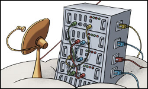

% last review: 2026-03-10

% review schedule: 1 year

% ISMSControl: 8.19

{ .logo }

# Virtual machines

- VMs are run on the Linux Qemu/KVM hypervisor.

- Virtual disks are stored in Ceph RBD volumes.

- The guest operating system is a 64-bit NixOS Linux managed by the Flying Circus.

  > - Packages are installed through the managed components (roles) globally or in your
  >   service user using Nix. You are also free to compile
  >   things in your service users' home. However, on NixOS, this can have
  >   suprising effects - talk to us if you need to do that.
  > - We are always looking for more components to manage for you but as a
  >   general rule new managed components take their time to develop them.
  >   Contact us if you would like to see a managed component we do not yet
  >   support.

- CloudInit based operating systems are supported and managed by the customer.

- VMs can be assigned resources:

  > - 1-12 virtual CPU cores
  > - 1-128GiB RAM (the customer API limits you to 64GiB, talk to us if you need more)
  > - 30GiB-10+TiB disk (note that filesystems become unwieldy at a certain size, we strongly recommend looking into using our S3-compatible object storage in those cases)

- Resources can be resized:

  > - CPU and RAM changes currently require a reboot of the VM.
  > - Disks can be grown on the fly without a reboot.
  > - Shrinking disks is not supported. Growing a disk is very fast and
  >   thus we recommend starting small and growing as needed. If you need
  >   to drastically shrink a disk you need to provision a new VM.

## Maintenance

For every project our automatic maintenance window is by default set between
22:00 and 5:00 (Europe/Berlin) with a pre-announcement period of 12 hours.

When our tools notice that maintenance is required they will automatically
pick a window matching the configured limits and notify your technical contacts.

## Reboot

Automated reboots are announced according to the maintenance schedule. Users
granted the `sudo-srv` permission are able to reboot a VM immediately via the customer portal at <https://my.flyingcircus.io>.

Machines should *not* be rebooted manually on the command line (e.g. `sudo systemctl reboot`). Monitoring systems will consider this *unplanned*, likely causing an alarm.

## Deletion

% ISMSControl: 8.10

VMs are deleted in a multi-stage process that takes around 38 days. You can
schedule the deletion of a VM at earliest for the next day (midnight
Europe/Berlin).

The stages of deletion are:

Prepare

: (t-5 days)

  Create a maintenance period to let technical contacts know that a VM
  is due for deletion soon.

  Also, add downtimes in our monitoring systems to stop any alerts related
  to the VM starting from their deletion date.

Soft

: (at t=0)

  Shutdown the VM but keep all existing records, IPs, disks, etc.

  At this point you can still cancel the deletion and start up the VM as it was
  including all persistent data.

Hard

: (t+3 days)

  Delete the VMs hard disk from activate storage.

  Also delete all records from our directory and allow the IPs to be reused.

Purge

: (t+32 days)

  Delete the VMs backups.

Recycle

: (t+38 days)

  Delete the VM deletion notice which will in turn allow the VMs name to
  be used again.

## Minimum memory requirements (NixOS-based VMS only)

Even before your actual application starts, the operating system and its infrastructure components require RAM. We have a minimum memory requirement of 3 GiB for virtual VMs running our NixOS platform, which - under extreme circumstances - be exhausted by system services.

To understand where our memory requirements come from and to check whether we might be exceeding those assumptions, we provide a detailed list of the expected memory consumption on a small machine. Some of those usages are dynamic and may be (much) larger on larger VMs with a higher load:

### Kernel internal structures (150 MiB)

On a 3 GiB VM the kernel reserves around 150 MiB for internal purposes in a way 
that this memory will not be visible in the "MemTotal" fields of monitoring tools like "top".

On larger machines this is expected to asymptotically reach around 2% of the virtual memory the VM is provisioned with. A 64 GiB VM can thus consume around 1,3 GiB of reserved kernel space.

### System management tools (1.1 GiB)

Our platform is designed to provide reliable system upgrades and deterministic states ("predictable outcomes"). To achieve this, we use specialized agents—tools responsible for building the system and its configuration while keeping it updated and clean. A large part of this involves system configuration evaluation via nixos-rebuild, which runs regularly (approximately every 10 minutes) to install new packages or apply configuration changes.

I addition some jobs like preparing larger release upgrades or cleaning the nix store may leverage a similar high amount. However, those tools are prohibited from running in parallel, thus limiting the usage to a bit more than 1 GiB. 

Some tools, like the nix store garbage collection, may use higher values depending on the system usage profile.

### Monitoring and Telemetry (1 GiB)

We run a variety of tools to monitor systems for proper operations at all times. Most tools are relatively light weight, but the number and combination of application-specific tasks adds up, especially because some of them spawn a number of (parallel) subprocesses to inspect the system state.

| Component / Service | Reserved Memory | Function & Purpose |
| --- | --- | --- |
| **Telegraf** | 256 MiB | **Metric Collection:** Continuously collects performance data (CPU, RAM, Disk I/O) and sends it to our central dashboards for visualization. |
| **Sensu** | 256 MiB | **Monitoring & Alerting:** Performs proactive system checks and reliably triggers alarms in the event of failures or critical states. |
| **Alloy (optional)** | 256 MiB | **Extended Telemetry:** A flexible agent for collecting, processing, and forwarding metrics, logs, and traces. |
| **Filebeat (1–2 instances)** | 100 MiB per instance | **Log Shipper:** Collects local system and application logs and transports them securely for platform-wide, central analysis. |
| **systemd journal** | 100 MiB | **Local Log Management:** Captures, stores, and structures the log output of the kernel and all local services. |
| **Fail2ban** | 100 MiB | **Intrusion Prevention:** Analyzes live logs and protects the server from brute-force attacks by blocking IP addresses after repeated failed logins (e.g., SSH). |

### Baseline Linux userland (100 MiB)

This includes the SSH daemon, systemd, and a variety of userland processes, including shells of logged-in users.

### Target size for buffers and VFS cache (1 GiB)

For any system to stay responsive and operational hot data must be cached in RAM and buffers must be available for data to stream from and to devices and the network.

We expect around 1 GiB to be available for this.

### Total Expected Memory Usage & Workloads (3 GiB Baseline)
When adding up the fixed and dynamic values mentioned above, it becomes clear that a base system under load (e.g., during a system update while monitoring is active) can easily consume 2 to 3 GB of RAM.

The values provided here represent the observed maximums in healthy systems. While these typically do not peak at exactly the same time, they may do so during periods of high stress. We expect that, under normal conditions, a VM with 3 GiB of RAM will be able to carry a small application load (approx. 512 MiB) without frequent issues.

**What comes "on top"?**
The actual workloads for which the server was commissioned are added to this baseline consumption:

* Component Roles: Databases like PostgreSQL or MySQL, Webgateway (NGINX, HAProxy), Docker or container orchestration like K3s.

* Frameworks & Applications: Your individual customer applications (e.g., Ruby on Rails, Django, Node.js, Java).

### Swap handling

To give systems some breathing room in unexpected situations we provide a certain amount of swap on all machines so that the kernel can write some data that is not currently needed on disk for a short period. To keep systems as responsive as possible, we generally avoid placing data in swap until significant memory pressure is detected.

If the memory pressure becomes too intense, the kernel will - at some point - start killing processes. We manage this in a proactive way, so that hard lockups are avoided and applications that are the likely culprit of the high usage will be restarted while the system is still healthy - avoiding unnecessary downtimes and giving direct feedback which application caused the memory spike. Those are automatically tracked in our ticket system and followed up on to investigate and adjust the system parameters as needed - either optimizing the configuration or adjusting the amount of available memory.
