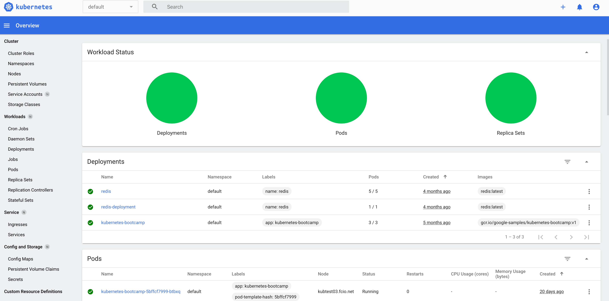

.. _nixos-kubernetes:

Kubernetes Cluster
==================

.. note::

    Kubernetes support is – at the moment – still experimental. Feel free
    to use it but we suggest contacting our support before putting anything into
    production.

Kubernetes Version and Documentation
------------------------------------

The current version is Kubernetes 1.21. Refer to the
`Kubernetes manual <https://kubernetes.io/docs/home/>`_.

Roles
-----

.. warning::
    The networks `10.0.0.0/24` and `10.1.0.0/16` will be used by Kubernetes for
    services and pods. They must not overlap with existing networks.
    Modify the defaults if needed before activating Kubernetes roles as
    described in :ref:`nixos-changing-kubernetes-networks`!

By using our Kubernetes roles, you can set up a Kubernetes cluster for your
project automatically. We provide three roles:

The **kubernetes-master** role runs cluster management services and the Kubernetes API.
There must be exactly one VM per project with the master role.
Multi-master setups are not supported (yet).

VMs with the **kubernetes-node** role run pods that are assigned to them by the master.
There must be at least one node per project. Using at least 3 nodes is recommended.
Additional node VMs can be added at any time. They automatically register with the master.

**kubernetes-frontend** allows a VM to access the cluster network of the project.
HAProxy can be used to load-balance incoming traffic to pods.

The roles can be combined on a machine.

.. warning::

   Changing the master VM is not supported and requires substantial manual intervention.

Activating the node role on an existing master-only VM works,
but `taints <https://kubernetes.io/docs/concepts/scheduling-eviction/taint-and-toleration/>`_
must be disabled manually to run pods on it.

Cluster Management
------------------

**sudo-srv** users can run :command:`kubectl` on the master VM to manage the
cluster. You can also use the dashboard or :command:`kubectl` on your local
machine as described in :ref:`nixos-dashboard-and-external-api`.

Basic Health Checks
^^^^^^^^^^^^^^^^^^^

Check that the master/API is working:

.. code-block:: console

    $ kubectl cluster-info

Check that the nodes are working:

.. code-block:: console

    $ kubectl get nodes

.. _nixos-dashboard-and-external-api:

External API Access
-------------------

**sudo-srv** users can generate a kubeconfig usable for :command:`kubectl`
by running :command:`kubernetes-make-kubeconfig`
on the VM with the master role. This kubeconfig contains all information needed
for access and can be copied to any machine.

.. warning::

  Protect kubeconfig files.
  They allow unrestricted access to the Kubernetes cluster!

Run:

.. code-block:: console

    $ kubernetes-make-kubeconfig > $USER-$HOST.kubeconfig

The kubeconfig contains the client certificate for the user and a
token to access a service account associated with the user.
Running the script for the first time sets up the service account.
Certificate and token provide **cluster-admin** privileges.
For authentication, Kubectl uses the SSL client certificate.

The API can be accessed from any machine using the kubeconfig:

.. code-block:: console

    $ export KUBECONFIG=./user-test.kubeconfig
    $ kubectl cluster-info

You can also move the kubeconfig to :file:`~/.kube/config` to use it as the
default config.

The certificate is valid for 365 days.
You must generate a new kubeconfig when the certificate expires.

Dashboard
---------

The Kubernetes dashboard can be accessed via `https://kubernetes.<project-name>.fcio.net`,
for example `https://kubernetes.myproject.fcio.net`.

The Kubernetes dashboard has full cluster admin privileges and is protected by HTTP basic auth.
Only users in the **login** group are allowed to log in.

After signing in with your FCIO credentials, a dashboard for a healthy cluster
should look like this:

Services
--------

A Service provides a way to access an application running on a set of pods
independent of the real location of the pods in the cluster.

Every VM with a Kubernetes role runs a `kube-proxy` that sets up iptables rules that allows
access of Kubernetes services via their **Service IP** (also called **Cluster IP**)
in the virtual service network. The default is *10.0.0.0/24*.

The `kube-proxy` provides load-balancing if there are multiple pods running behind a
a service.

Services can use fixed or floating ClusterIPs. They can be resolved from all Kubernetes VMs:

.. code-block:: console

    $ dig myapp.default.svc.cluster.local

where *myapp* is a service in the namespace *default*.

Pod networks (subnets of 10.1.0.0/16) can also be accessed directly from any Kubernetes VM.
You can get the Pod IPs belonging to a service with a wildcard DNS query:

.. code-block:: console

    $ dig *.myapp.default.svc.cluster.local

For more information about Kubernetes services, refer to the
`Service chapter in the Kubernetes manual <https://kubernetes.io/docs/concepts/services-networking/service/>`_.

External Access to Services and Load Balancing
----------------------------------------------

HAProxy on a **kubernetes-frontend** VM can be used to proxy traffic to services and load-balance between pods.
It can discover backends via cluster DNS and scale automatically with the number of pods.

We don't support automatic configuration of external load balancers yet.
We plan to fully support that in the future.
You can still use the **LoadBalancer** service type but the service will show up as "Pending" forever.

This example listens to external IPv4 and IPv6 on port 443 and load-balances the
traffic to the pods belonging to the *ingress* service in the default
namespace::

    defaults
        balance leastconn

    listen ingress
        bind 198.51.100.2:443
        bind [2a02:238:f030:::1000]:443
        server-template pod 20 *.ingress.default.svc.cluster.local:443 check resolvers cluster init-addr none

For more information, see this article about `DNS for Service Discovery in HAProxy
<https://www.haproxy.com/blog/dns-service-discovery-haproxy/>`_.

For details on how to configure HAProxy, please refer to the
`documentation <http://cbonte.github.io/haproxy-dconv/2.3/configuration.html>`_.

.. _nixos-changing-kubernetes-networks:

Changing Kubernetes Networks
----------------------------

.. warning::

    These settings should only be changed before assigning Kubernetes roles.
    Changing them later requires manual intervention.

The service network which is *10.0.0.0/24* by default can be changed with the NixOS option
`services.kubernetes.apiserver.serviceClusterIpRange <https://nixos.org/nixos/options.html#services.kubernetes.apiserver.serviceclusteriprange>`_.
You also have to change `flyingcircus.roles.kubernetes.dashboardClusterIP` then.

The pod network which is *10.1.0.0/16* by default can be changed with the NixOS option
`services.kubernetes.clusterCidr <https://nixos.org/nixos/options.html#services.kubernetes.clusterCidr>`_.
