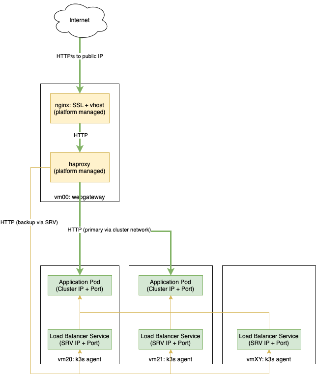
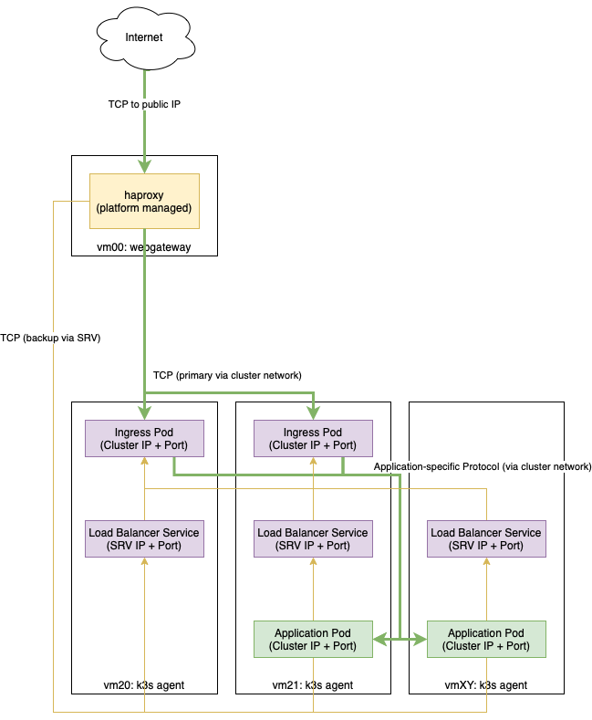

.. _nixos-kubernetes:

************************
Kubernetes Cluster (k3s)
************************

.. note::

    Kubernetes support is in beta. Feel free to use it but we suggest contacting
    our support before putting anything into production.

`Kubernetes <https://kubernetes.io>`_ is an open-source system for automating
deployment, scaling, and management of containerized applications. At the
Flying Circus we provide a hybrid system that integrates well with our existing
managed services and is based on a streamlined Kubernetes distribution called
`k3s <https://k3s.io>`_.

As Kubernetes has a non-trivial amount of complexity and requires a sufficiently
large amount of resources to operate properly we recommend to:

* take the time to `understand the foundations of Kubernetes <https://kubernetes.io/docs/tutorials/kubernetes-basics/>`_ and maybe review the `k3s documentation <https://rancher.com/docs/k3s/latest/en/>`_

* start by implementing our reference architecture and grow from there

The remainder of this documentation assumes that you are aware of the basics of
Kubernetes and understand the general terminology.

.. note::

    As `k3s` has simplified Kubernetes it also introduced new words. All the
    components of the control plane (sometimes called a `master`) have been
    pulled together into the `k3s server`. All the parts making up a `node` are
    run in a process called the `k3s agent`. We will prefer to use the words
    `server` and `agent` through the remainder of this document.

Reference architecture and minimal resource requirements
========================================================

Our Kubernetes reference architecture is intended to both easily create a
standalone Kubernetes cluster for `cloud native` applications but also to
integrate well into existing environments.

You can run one Kubernetes cluster per resource group and we generally recommend
to use separate clusters (and thus separate resource groups) for independent
projects. This will give you the most flexibility and will integrate optimally
into our platform aligning well on topics like access management, monitoring,
SLAs, maintenance, etc.

In our reference architecture you will need at least 4-5 virtual machines with
the following roles:

* **Frontend**

    Minimal resource requirements: 1 CPU, 4 GiB RAM, 30 GiB HDD, public IP addresses as needed

    VM that runs the `webgateway` role and accepts traffic from the internet.

* **K3s server**

    Minimal resource requirements: 2 CPU, 8 GiB RAM, 30 GiB SSD, public IP for dashboard

    VM that runs the `k3s-server` role and provides the Kubernetes control plane with a
    PostgreSQL database.

    Can optionally run OpenVPN and limit dashboard access to VPN users.

* **K3s agents**

    Minimal resource requirements: 4 CPU, 8 GiB RAM, 30 GiB HDD

    VMs that run the `k3s-agent` role and will be used to run your workloads.
    One node will be sufficient to get started but you will likely run two or
    many more for serious projects.

    Nodes never receive public IP addresses. All traffic from outside the
    resource group must pass through the webgateway.

* **Persistent volume storage (NFS subdir, optional)**

    Minimal resource requirements: 1 CPU, 8 GiB RAM, 50 GiB SSD

    VMs that run the `k3s-nfs` role and are used to satisfy persistent volume
    claims so that pods can be moved between nodes without loosing access to
    their volumes.

.. note::

    Our experiments have shown that scaling the cluster down further or using
    shared resources for the control plane and applications can quickly lead to
    cluster instability.

Interaction
===========

In general (human) user accounts with the `sudo-srv` permission are granted
access to the Kubernetes cluster.
The :command:`kubectl` command can be used on the K3s server directly after
login via SSH. The :command:`helm` command is also available there.

The `KUBECONFIG` environment variable is set to a usable kubeconfig so other
user-installed tools that use that variable should work, too.

Generate Kubeconfig for External Access
---------------------------------------

To interact with the cluster from the outside, like `kubectl` on a remote machine,
via the **dashboard** or the **API** you need a kubeconfig file.

As user with `sudo-srv` permission, generate a kubeconfig on the K3s server
in the current directory by running :command:`kubernetes-make-kubeconfig`:

.. code-block:: console

    $ kubernetes-make-kubeconfig > $USER-$HOST.kubeconfig

.. warning::

  You must protect kubeconfig files! Access to a kubeconfig file grants unlimited
  access to the Kubernetes cluster!

Kubernetes Dashboard
--------------------

The kubernetes **dashboard** is available on the K3s server and is reachable
through our customer portal via the "Kubernetes" button on all resource groups
with active Kubernetes clusters.

To log in, provide a kubeconfig that has been
generated by :command:`kubernetes-make-kubeconfig` as described above.
Kubeconfig files for the dashboard must contain a valid service account token.

Cheat sheet
-----------

This is a shortened version of :command:`kubectl` commands, you can look up the
`full cheat sheet on kubernetes.io
<https://kubernetes.io/de/docs/reference/kubectl/cheatsheet>`_.

Show the current configuration:

.. code-block:: console

  $ kubectl config view

Show all services in namespace:

.. code-block:: console

  $ kubectl get services

Show all pods in all namespaces:

.. code-block:: console

  $ kubectl get pods --all-namespaces

Show general cluster information:

.. code-block:: console

  $ kubectl cluster-info

Show nodes in the cluster:

.. code-block:: console

  $ kubectl get nodes

Networking
==========

Our Kubernetes cluster uses `flannel` with the `host-gw` backend. Nodes interact
with each other on the `srv` network and create an overlay network
automatically. VMs with specialized roles (`k3s-server`, `k3s-agent` and the
`webgateway`) have full access to the overlay network.

Interaction with non-Kubernetes services
-------------------------------------------

Kubernetes VMs within a resource group can coexist easily with non-Kubernetes
VMs and all services managed by our platform can be accessed as usual by
addressing the VM names (like vm01).

Conversely non-Kubernetes VMs can not access the cluster network directly but
can either access services using haproxy (or nginx) through the frontend or can
access load balanced services directly by accessing any Kubernetes VM via its
name and using the associated load balancer port.

Exposing services
-----------------

To expose a kubernetes service (ports on a pod) to the outside world there are
multiple moving parts that can be composed depending on your scenario and
preferences:

* our platform-managed `webgateway` providing one or more public IP addresses
  and a managed nginx (to associate virtual hosts and run SSL termination)
  and haproxy (to pass traffic in either HTTP or TCP mode to the cluster)

* `service` resources that expose your application's ports on a cluster IP/port
   for each pod

* `load balancer` service resources that provide a port on every agent and
  forward the traffic to the pods.

* `ingress` controllers that may (or may not) terminate SSL and do virtual host
  association and deliver traffic to your application's pods

Lets look at two typical scenarios on how to compose those:

Scenario 1: HTTP/s using the platform-managed nginx
^^^^^^^^^^^^^^^^^^^^^^^^^^^^^^^^^^^^^^^^^^^^^^^^^^^

In this scenario you run an HTTP application in Kubernetes and want to expose
it to the outside world having SSL an virtual host termination managed by
the Flying Circus platform without adding an ingress controller.

Here's a diagram of the setup focusing on your application's traffic flow:

The setup in Kubernetes looks like this:

* expose your application's port using a service (8888 in our example)

* bind your application's port to a load balancer (7654 in our example)

In our platform the load balancer is integrated by providing custom NixOS
configuration on the webgateway VM:

.. code-block:: nix

    # /etc/local/nixos/myappfrontend.nix
    { ... }:
    {

      flyingcircus.kubernetes.frontend.myapp = {
        # where haproxy should be listening
        bind = [ "127.0.0.1:8080" ];

        # port the load balancer service is listening on
        lbServicePort = 7654;
        # port the application is exposed on the clusterIP of the pod.
        podPort = 8888;
      }

      flyingcircus.services.nginx.virtualHosts."myapp.example.com"  = {
        forceSSL = true;
        locations."/".proxyPass = "http://localhost:8080";
      };

    }

This will configure haproxy to listen locally on port 8080 and will generate
backend servers that are dynamically populated with the pods' cluster IPs
automatically when you add/remove pods. In the case that something happens to
the cluster network we also configure the load balancer entries as backup
servers so haproxy will try to reach the pods through a less optimal but
potentially still working network path.

It also configures nginx to listen on all public IP addresses for requests
accessing "myapp.example.com", ensure that SSL (using Let's Encrypt) is used
and pass traffic to haproxy.

Scenario 2: TCP passed to an internal ingress controller
^^^^^^^^^^^^^^^^^^^^^^^^^^^^^^^^^^^^^^^^^^^^^^^^^^^^^^^^

A second typical scenario is if you want to handle non-HTTP protocols or want
to terminate SSL and virtual host configuration within Kubernetes.

Here's a diagram of the setup focusing on your application's traffic flow:

The setup in Kubernetes looks like this:

* expose your application's port using a service

* (bind your application's port to a load balancer)

* deploy an ingress controller and configure it to pass traffic to your
  application (port 8443 in our example)

* bind the ingress controller to a load balancer (port 8888 in our example)

In our platform you connect the ingress load balancer with our webgateway:

.. code-block:: nix

    # /etc/local/nixos/myappfrontend.nix
    { ... }:
    {

      flyingcircus.kubernetes.frontend.myapp = {
        # haproxy now listens on a public IP address
        bind = [ "192.0.124.96:443" ];
        mode = "tcp"

        # port the ingress load balancer service is listening on
        lbServicePort = 8888;
        # port the ingress controller is exposed on the clusterIP of the pod.
        podPort = 8443;
      }

    }

Configuration reference
^^^^^^^^^^^^^^^^^^^^^^^

As the individual parts can be combined in multiple ways depending
on your requirements there are a few more options available:

.. code-block:: nix

    { ... }:

    {

        flyingcircus.kubernetes.frontend.myapp = {
          # Where this haproxy frontend should listen to.
          binds = [ "127.0.0.1:8080" ];

          # If the real service name is not `myapp`.
          serviceName = "traefik";
          # If you want to use a non-default namespace
          namespace = "kube-system";

          # Choose between tcp and http mode.
          mode = "tcp";

          # Additional parameters to the generated haproxy server entries
          haproxyExtraConfig = "maxconn 5";

          # The port where the Kubernetes load balancer is listening on.
          lbServicePort = 80;

          # To optimize network traffic you can configure the pod ports here.
          # If no pod ports are given then traffic will always go through the
          # kubernetes load balancer to reach the pods.
          podPort = 8443;

          # haproxy needs to know a limit of server entries that it will
          # generate. The default is 10 and you can adjust this as needed.
          maxExpectedPods = 5;

        };

    }

Storage
=======

Our Kubernetes environment supports two persistent volume types by default:

* local
* nfs-subdir-external-provisioner

The nfs subdir provisioner allows adding VMs that run the `k3s-nfs` to the
cluster's resource group and will automatically be available for all nodes to
allocate separate volumes using subdirectories (instead of sharing a single big
NFS volume).

Depending on your IO requirements you can use HDD/SSD class VMs for local
storage or NFS.

We also recommend to consider using our S3-compatible API for storing object
data.

Known limitations
=================

* Due to our high security requirements for user passwords accessing the
  dashboard directly from the internet using HTTP Basic auth may be very slow.
  Access through the VPN is recommended in that case as it does not require
  basic auth protection.

* Changing the VM which runs the `k3s server` is not supported and requires
  substantial manual intervention.

* Changing ports on pods and load balancers will not be picked up by our
  webgateway automatically for now. Adding and removing pods during deployments
  and while scaling does happen automatically though.

* By default our setup uses a cluster network that allows 253 nodes and 253
  ports per node. This can be adjusted but may require larger interventions
  with downtime if done in a production system.

* We currently do not drain/uncordon nodes when performing service or VM
  restarts in scheduled maintenance windows.
