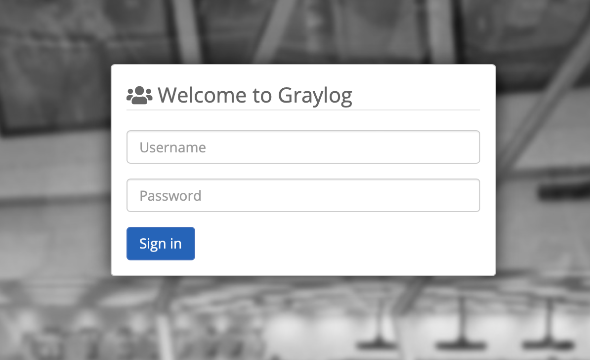

.. _nixos-loghost:

Loghost
=======

The Loghost role provides a managed instance of `Graylog
<http://www.graylog.org>`_ 3.3.x for log data collection, processing and
analysis.

Other machines in the same project are automatically configured to send their
system journal to the project's loghost.

Configuration
-------------

Graylog runs without additional config. If you want to make the web UI and REST
API public, you need to add :ref:`custom Nix config <nixos-custom-modules>`:

.. code-block:: Nix

  { ... }:
  {
    flyingcircus.roles.graylog.publicFrontend = {
      enable = true;
      # default value for the example project
      # hostName = "graylog.example.fcio.net";
    };
  }

Without that setting, Graylog UI and API can only be accessed via the
:ref:`SRV network interface <logical_networks>`, by other machines in the same
project or via :ref:`VPN <nixos-external_net>`.

Interaction
-----------

For projects that have a machine with the loghost role, you'll find an active
Logs** button on the `My Flying Circus Projects Dashboard
<https://my.flyingcircus.io>`_. From there you will be transferred to Graylog's
web dashboard which is, for example, at ``https://graylog.example.fcio.net`` for
the *example* project and default configuration.

.. image:: images/graylog.png
  :width: 350px

You can log in with your My Flying Circus credentials:

API
~~~

Graylog implements its web interface as first consumer of its REST API. One
can also access it from everywhere when *publicFrontend* is enabled via, for
example: ``https://graylog.example.fcio.net/api``

The API can also be accessed from the same project via SRV port 9002, for
example using ``http://example90.fcio.net:9002/api`` when loghost is running on
the *example90* machine.

You can interactively explore it using the swagger-based API browser at, for
example:
``https://graylog.example.fcio.net/api/api-browser/global/index.html``

For authentication from the command line or scripts, use access token.

To see Graylog's status, using `HTTPie <https://httpie.io>`_ here as client:

.. code-block:: shell

  http --auth 1asceepv1ika420gjsqe0dcdlelma1msaurkbrrr5mc55efom93g:token \
    https://graylog.example.fcio.net/api/cluster

The generated access token, here
*1asceepv1ika420gjsqe0dcdlelma1msaurkbrrr5mc55efom93g* is used as the user part
for HTTP Basic auth, the password is just the word *token*.

For more information about how to configure access token and general usage of
the API, refer to the official `Graylog API documentation
<https://archivedocs.graylog.org/en/latest/pages/configuration/rest_api.html>`_.

Inputs
------

The following inputs are active by default:

* Beats TCP on port 12302
* GELF TCP on port 12202
* Syslog UDP on port 5140

Implementation Details
----------------------

.. image:: images/graylog_min_arch.png
  :class: logo
  :width: 250px

By default, the role sets up Graylog, Nginx, HAproxy, Elasticsearch and MongoDB
on the loghost machine.

All machines run `Filebeat <https://www.elastic.co/beats/filebeat>`_ instances
automatically using the journal input to read messages from the system journal,
sending them to Graylog via the Beats TCP input.

Graylog
~~~~~~~

Graylog receives incoming messages in an internal journal and stores them after
processing in :ref:`Elasticsearch <nixos-elasticsearch>`.
By default, the roles sets up a local Elasticsearch instance which is used by
Graylog automatically.

It's also possible to have more complex setups with multiple Elasticsearch
instances on other machines for more redundancy and performance for large
amounts of log input.  In typical cases, Graylog with the default setup is able
to handle tens of thousands of messages per second.

Graylog's settings are stored in a MongoDB instance. It isn't used for log data.

Nginx
~~~~~

Nginx provides SSL termination if the public frontend is enabled.
Nginx listens on port 80 and 443 on the :ref:`FE interface <logical_networks>`
in that case. Certificates are renewed automatically using Let's Encrypt.

Port TCP 9002 on the :ref:`SRV interface <logical_networks>` is always available
and provided for machines in the same project which need to access the Graylog
API directly without authentication.

HAProxy
~~~~~~~

Log data is sent to various ports opened by HAProxy which forwards the
data to the Graylog input ports. This setup provides the possibility to have
multiple Graylog instances with non-standard configuration.
