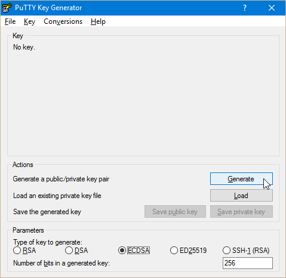
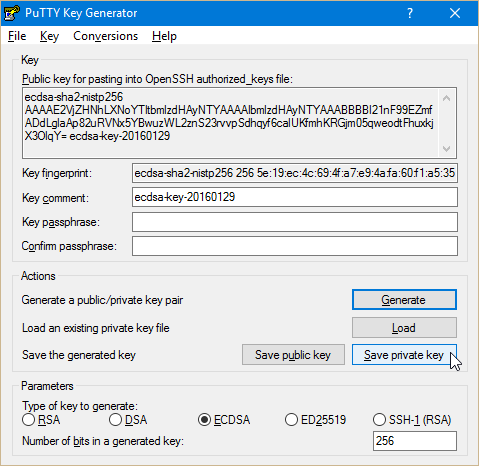

# Generating SSH keys { #ssh-keygen }

Flying Circus machines can be accessed via SSH using your Flying Circus
account.

According to our [data protection policy](../../security/data-protection.md#entry-control), we require
using a cryptographic authentication instead of a password. For this
authentication method you need to generate an SSH key pair.

SSH key pairs consist of two individual parts: a private and a public key. The
private key *must always* be kept secret, much like a password. The public
part, however, may be transported (as the name says) publicly and will be
deposited on our servers. Your private key will then be used to verify your
access.

The following steps will show you how to generate this key pair and how to set
up your account to use it.

## Generating a key pair on Linux { #ssh-keygen-linux }

On Linux systems, the tool `ssh-keygen` can be used to generate a SSH
key pair. In general, all common Linux distributions ship with this tool. For
further details about its usage, please refer to the `ssh-keygen(1)`
manual page.

If no parameter is specified on execution, `ssh-keygen` will create an
RSA key that can be used for SSH 2 connections. This is sufficient for
Flying Circus accounts. It is advisable to protect your private key file
with a passphrase. This minimizes the risk of your key pair being compromised,
especially when storing your private key on remote machines.

A more secure ED25519 key (recommended) can be generated using:

```
ssh-keygen -t ed25519 -o -a 100
```

It has to be ensured that ssh-keygen is run as the user that is intended to
connect to the respective Flying Circus account. Alternatively, the keypair has
to be transferred to the designated user's SSH directory.

If not specified differently, The keypair will be written to
`$HOME/.ssh/`. It consists of two files: the private key file and the
public key-file:

```
$HOME/.ssh/id_ed25519
$HOME/.ssh/id_ed25519.pub
```

Please don't use DSA as these keys are no longer supported and considered
secure.

To complete the process, upload the new public key to your account at
[my.flyingcircus.io](https://my.flyingcircus.io) so you can use it for
logging into your VM

## Generating a key pair on Windows { #ssh-keygen-windows }

On Windows, the program `PuTTYgen` can be used to generate a SSH
keypair. It is part of the program suite `PuTTY` and can be retrieved
from the [vendor's website](http://www.putty.nl/download.html). It can etiher
be download separately or as part of the complete program suite which is
provided as a setup program.

After launching the program, the following window shows up:



To start generating your SSH key pair, just make sure that a ECDSA or ED25519
key is selected in the Parameters section.

After clicking on Generate, `PuTTYgen` might requests you to move the
mouse around in order to generate a sufficient amount of randomness. This
contributes to the uniqueness and the security of your SSH key pair. A
progress bar indicates the progress of the key pair generation. Depending
on chosen parameters and used hardware this can take a few moments.

Once the process is finished, the following window shows up:



In this window you can apply additional settings to your key pair. You may for
instance enter a comment that makes it easier to identify your public key by for
example entering a purpose or your name. Further, it is advisable to protect
your private key by entering a passphrase.

To complete the generation process, save your public key and your private key to
your hard drive. Finally put your fresh created public key to your account at
[my.flyingcircus.io](https://my.flyingcircus.io). You will find the
compatible public key snippet inside the field at the top of the window.

## Generating a key pair on Mac OS X { #ssh-keygen-mac }

The key pair generation process on Mac OS X is almost the same as on Linux
systems because Mac OS X is running on a UNIX-compatible architecture.

To generate your key pair, simply open a terminal and follow the instructions
given for [generating a key pair on Linux](ssh-keygen.md#ssh-keygen-linux). For more
detailed instructions for Mac OS X have a look at this [tutorial](https://drupal.org/node/1070130).
