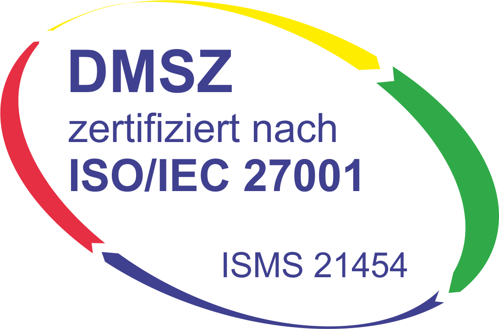

% last review: 2026-07-31

% review schedule: 1 year

% Customers need to be notified when substantial changes occur in this document!

# Data protection measures { #data-protection }

[Deutsche Version](../de/security/data-protection.md)

In addition to purely technical security measures we implement additional
measures to provide a safe environment for your and your customers' data
based on the following standards and regulations:

{ .off-glb }

- [Certified](https://flyingcircus.io/iso-27001-en.pdf) Information Security Management System (ISMS) based on ISO/IEC 27001,
- Germany's [federal data protection law (BDSG)](http://de.wikipedia.org/wiki/Bundesdatenschutzgesetz), and
- the EU's [General Data Protection Regulation (GDPR)](https://de.wikipedia.org/wiki/Datenschutz-Grundverordnung).

## Responsible bodies

**Information Security officers:**

Christian Zagrodnick (CISO) \
<mailto:cz@flyingcircus.io>

Christian Schmidt (ISO) \
<mailto:cs@flyingcircus.io>

**Data protection officer:**

Prof. Dr. Andre Döring \
Robin Data GmbH \
Fritz-Haber-Straße 9 · 06217 Merseburg \
<https://www.robin-data.io> · <mailto:datenschutz@robin-data.io> \
[+49 3461 4798960](tel:+4934614798960)

## General

This document describes the security measures required by GDPR Art. 32 (1). Based on our ISO 27001 certification we operate a risk-based ISMS leading to extensive security measures and documentation. We don't replicate the entire documentation here but only the gist.

As some of the requirements of the law depend on the specific (contractual)
situation, we'd like to first outline the general situation that hosting in
the Flying Circus puts you in:

Order data processing

: applies within the framework of the GDPR. We will implement a contract for
  data processing suitable to the GDPR with you.

Duty to give information

: People who are affected by processing of data have right to request
  information about what data about them is being stored as well as about the
  processes how this data is being kept secure.

Periodical check for compliance to regulations:

: The client has the responsibility to routinely check that applicable regulations
  are being conformed to by their contractor. Yearly checks appear to
  be sufficient even for highly sensitive data (e.g. medical records). The
  result needs to be documented in written form. The audit usually needs to be
  performed by a third party.

## Measures

### (1) Equipment access control { #entry-control }

**Purpose: deny unauthorized persons access to processing equipment used for processing**

The physical assets (servers, switches, hard drives, ...) are located in EU
data centers, which may be operated by third parties. The ownership of the physical equipment
is with the Flying Circus, or, in special cases by our customers
[^customer-owned].

For each data center used by us we require the following measures:

- video surveillance (outside facilities, in-doors and rack corridors)
- two-factor security for granting access with logging
- physical access must be documented
- preferably 24 hour guard services with linked alarm system
- separate physical security zones for general areas, data center
  infrastructure and customer-accessible areas
- separately locked racks with the possibility to use custom locks and keys.

% ISMSControl: 7.1
% ISMSControl: 7.2
% ISMSControl: 7.3
% ISMSControl: 7.4

We maintain a separate [data-centers](../infrastructure/hardware/data-centers.md#data-centers).

Physical access to data processing equipment may be performed only by the Flying Circus' administrators. Administrators may delegate physical access to other people (e.g., data center personnel).

#### Low-security locations

The Flying Circus operates one low-security zone called `development` (used
for the development of the Flying Circus infrastructure).

Those locations are currently not allowed to be used for customer data storage
as they are not sufficiently protected.

Due to this limitations, the services in high-security locations are not allowed to depend on services provided in low-security locations.

### (2) Data media control

**Purpose: prevent the unauthorized reading, copying, modification or erasure of data media**

Only Flying Circus administrators may have physical access to data media. Access may be delegated e.g. to data center personnel.

Transfer of data media between secure locations is handled by Flying Circus personnel or trusted shipping providers.

Disposal of used media happens using a certified data destruction service
provider.

### (3) Storage control { #data-at-rest-encryption }

**Purpose: prevent the unauthorized input of personal data and the unauthorized inspection, modification or deletion of stored personal data**

All data in our [storage clusters](../infrastructure/block-storage.md#infrastructure-storage) is stored encrypted.
This includes the *Virtual Disk Block Storage*, our *S3-compatible Object
Storage*, and [all automated backups](../infrastructure/backup.md#backup). There are technical and
organisational measures in place to protect the relevant keys.

On a technical level, we utilise the common Linux [cryptsetup](https://gitlab.com/cryptsetup/cryptsetup) software stack with LUKS2 metadata
and XTS-AES-512 cipher. We regularly review recommendations in standard
guidelines or working groups and are able to update the used encryption
parameters as needed.

Additionally:

- We delete data after the retention times required by tax or commercial law.
- Access log files are being anonymised.
- We delete customer data upon customer's request.

### (4) User control

**Purpose: prevent the use of automated processing systems by unauthorized persons using data communication equipment**

% ISMSControl: 5.16
% ISMSControl: 5.17
% ISMSControl: 8.5

Machines managed within the Flying Circus can be accessed by a variety of ways for
management purposes: SSH, web interfaces, and others. For those we employ
a homogeneous scheme to identify and authorize users within the Flying Circus.
Management access to systems must use encrypted communication channels.

Identification and authorization of customer applications, not managed by the Flying Circus infrastructure, are not covered by our security responsibility. Our
customers are required to ensure the security of their applications themselves.

User identification must be performed using *personal* credentials, so that
actions can be traced back to an individual originator. Thus, sharing one's
credentials with another person is prohibited.  Credentials can be either a
username and a cryptographic measure (e.g. a private/public key scheme) or a
password, depending on the applicability.

Users with a Flying Circus account are required to manage their password securely: Passwords must not become compromised if a device is being accessed unauthorizedly (logically or physically). Things to consider are for example: Home directory on a notebook, keychain or password manager software, backups, USB sticks, smartphones. Strongly encrypted storage of passwords is permitted and even advised. For Flying Circus staff there is a separate *guideline for handling secret authentication information*.

All hardware machines have emergency root logins which may only be used by
Flying Circus administrators if regular user
authentication is not working correctly. Such uses are monitored and must be documented.

All privileged actions need to be securely logged. For machines based on our current (NixOS) platform, this is achieved via a local logging journal, which cannot be tampered with by normal users. Additionally systems logs are shipped to a central log server within the same site where the logs are analysed and monitored.

SSH logins must be performed using SSH keys. Password authentication is not allowed and prevented by the system configuration. Successful SSH logins to machines are logged, unsuccessful SSH login attempts are not [^log-unsuccessful-attempts]. Excessive unsuccessful SSH login attempts automatically cause a blocking via firewall rules.

Passwords for physical machines granting access to root accounts and IPMI
controllers are stored as copies in a strongly encrypted password manager.

### (5) Data access control { #access-control }

**Purpose: ensure that persons authorized to use an automated processing system have access only to the personal data covered by their access authorization**

% ISMSControl: 5.15
% ISMSControl: 5.18
% ISMSControl: 8.3

Customer-owned virtual machines may be accessed by all Flying Circus administrators implicitly. In projects additional staff (e.g. support staff) may get explicit access. Access by others (e.g., customer personnel, third parties) must be authorised by a client representative.

% ISMSControl: 5.16

Users are centrally managed using <https://my.flyingcircus.io>. Users are automatically provisioned to all relevant systems, including proper removal of access rights.

Flying Circus implements a permission-based concept to separate application
maintenance tasks from privileged administrative tasks: for example, customer
software updates or database access versus OS updates or OS configuration.

% ISMSControl: 8.2

Privileged administrative access is generally not granted to customers.
In cases where another person who is not an
administrator is needed to solve a problem, a shared session between an
administrator and the other person must be established
(e.g. with `screen`).

Technically, there are three access variants to perform privileged
administrative operations:

1. Using a user account which has been granted the 'login' and
   'wheel' [permissions](../platform/users/index.md#permissions) for a certain project. This
   requires the user to log into a regular account using his SSH key and
   additionally provide his password to access privileged operations.
2. Using a user account which is member of the global
   group of administrators which grants access to
   all machines within the Flying Circus infrastructure.
3. Emergency root logins (see above in [entry-control](data-protection.md#entry-control)).

Authorized and unauthorized access to privileged operations is logged and analysed on a central loghost within the same site.
[^trace-tty]

Flying Circus maintains a set of permissions which enable users to perform
application maintenance and other semi-privileged tasks, e.g. access to
service user accounts or database administration rights. Permissions are granted
to individual users by the customer or upon customer request.

All permission assignments are traceable and explicitly documented: their
effects are documented in the configuration code and their assignments
are documented in the configuration database. A comprehensive list of users and
their permissions may be produced automatically on request.

Group accounts are generally not allowed to perform privileged administrative
operations to ensure traceability of actions.

% ISMSControl: 8.11

There are no special data masking regulations[^data-masking].

### (6) Communication control

**Purpose: ensure that it is possible to verify and establish the bodies to which personal data have been or may be transmitted or made available using data communication equipment**

Communication control is generally the responsibility of the customer's application.

Data entered into the Flying Circus portal is not transmitted to third parties.

### (7) Input control

**Purpose: ensure that it is subsequently possible to verify and establish which personal data have been input into automated processing systems and when and by whom the personal data were input**

The security of data entry, change, and deletion is generally part of the
customer's application. Customers must ensure that data entry, deletion, and
removal are handled appropriately according to their applicable data protection
laws.

However, during maintenance work it may be necessary that
administrators need to enter, change, or delete data records on a low technical
level to ensure the continued operation of the overall system. This will only
happen after having informed the affected customers and having documented this
in our issue tracking system.

Managed log files are rotated by the Flying Circus infrastructure automatically
with sensible retention times.

Changes in the Flying Circus portal (e.g., SSH keys) can be performed by
the customer themselves or through our support. If the change happens through
our support then it must be documented beforehand and confirmed by the customer
after the change has been performed.

### (8) Transport control

**Purpose: ensure that the confidentiality and integrity of personal data are protected during transfers of personal data or during transport of data media**

% ISMSControl: 8.26

All private data transferred past the boundary of a machine must use an
authenticated and encrypted communication channel (exceptions see below).
Data paths where sensitive information may be transferred include:

- Application data (e.g., database contents) is transferred from or to the
  customer using the standardised encrypted protocols, e.g., SCP/SFTP, https.
- Persistent data is saved on storage servers. Storage traffic is not encrypted
  due to performance reasons. Storage servers are connected to application
  servers using a private network. Machines on which administrative privileges
  are granted to customers are not allowed to connect directly to the storage
  network (see also [network-security](network.md#network-security)).
- Backups are transferred to backup servers at the same site using either an encrypted
  communication channel or the private storage network. Backup data may also be
  transferred to off-site backup servers to improve disaster recovery abilities. The transfer must be encrypted.
- In addition to application data, a system can generate data at runtime that
  contains sensitive information, for example log files. Log files usually do
  not leave the machine on which they were generated, unless the customer operates a logging server. Log data may also be transferred to a log server on the same site operated by Flying Circus via an encrypted channel. Only Flying Circus
  administrators may have access to the central log server.

### (9) Recovery

**Purpose: ensure that installed systems may, in the case of interruption, be restored**

Recovery scenarios are documented at [disaster-recovery](disaster-recovery.md#disaster-recovery).

### (10) Reliability

**Purpose: ensure that all system functions perform and that the appearance of faults in the functions is reported**

All systems are monitored continuously. Depending on the severity of the monitored system our emergency support is notified, a support ticket is created automatically, or tickets are created manually during monitoring review.

### (11) Integrity

**Purpose: ensure that stored personal data cannot be corrupted by means of a malfunctioning of the system**

Integrity is assured on several levels:

* filesystem-level checksums on XFS filesystems
* block-level checksums on Ceph bluestore OSDs
* redundant storage of data
* backups of data with hash-based integrity checks, see [backup](../infrastructure/backup.md#backup).

For details and recovery times, see [disaster-recovery](disaster-recovery.md#disaster-recovery).

### (12) Processing control

**Purpose: ensure that personal data processed on behalf of the controller can only be processed in compliance with the controller’s instructions**

The Flying Circus ensures that all actions taken by system administrators are
covered by a contract or order with the customers affected by the action. This
can be due to broad maintenance contracts or due to specific support requests.

Individual change requests should have an associated ticket in the Flying Circus
request tracking system. Other means of documentation to control changes are possible, e.g., explanatory commit messages in a version control system.

Specific actions performed will be reported to the customer if required.

### (13) Availability control

**Purpose: ensure that personal data are protected against loss and destruction**

% ISMSControl: 7.5
% ISMSControl: 8.14

The availability of resources depending on the data center facilities may be
delegated to the operator of the data center. The Flying Circus facilitates
service level agreements to make expectations about availability explicit. This includes proper air-conditioning and uninterruptible power supplies.

The selection of hardware is performed by the Flying Circus using professional
equipment and vendors. The Flying Circus facilitates standard procedures for
increased availability of single components (e.g., RAID storages, redundant
power supplies, spare components).

Customer data is regularly backed up according to the Flying Circus'
[backup schedule](../infrastructure/backup.md#backup). Restoration of past states may be performed
by administrators on request. Additionally, a
[disaster recovery plan](disaster-recovery.md#disaster-recovery) details failure scenarios,
our preventative and recovery measures.

### (14) Separability

**Purpose: ensure that personal data collected for different purposes can be processed separately**

To separate data from different customers the Flying Circus facilitates
virtualization: both virtual machines (to separate execution context) and
virtualized storage (Ceph) ensures that customers can only access data
belonging to them. Within a single machine access to different files and
processes is available using standard UNIX permissions.

Machines (both virtual and physical) live in a specific *access ring* (short:
ring):

- *Ring 0* machines perform infrastructure tasks. Thus, they need to process
  data belonging to several customers.  Only administrator access is allowed on
  such machines.  Examples include VM hosts and storage servers.
- *Ring 1* machines process data for a specific customer and are accessible to
  users associated to that customer. Examples include customer VMs.

All resources that belong logically together (e.g., VMs, storage
volumes) are bundled into *resource groups*. Those resources share that same set
of user accounts and permissions.

Access to S3-compatible object storage buckets is separated by resource group
with dedicated authentication credentials.

## Other measures

- Our support process and incident response measures are documented at [the support overview](../support/overview.md#support-details).
- We have a process for emergency and crisis management including contingency plans for critical business processes (business continuity). See also [disaster-recovery](disaster-recovery.md#disaster-recovery).

#### Footnotes

[^customer-owned]:
    If a customer owns equipment managed within the Flying Circus we
    require that this customer uses a separate rack with separate access control.

[^log-unsuccessful-attempts]:
    We consider not logging unsuccessful logins
    acceptable, as SSH logins are only valid using cryptographic private/public
    key authentication. Password logins are always rejected. Potential attack
    vectors are thus limited to stolen or cracked private keys or vulnerabilities
    in the SSH server software. Cracked keys are practically impossible using
    current technology. Known broken key formats are revoked/rejected regularly.
    Stolen keys or errors in the server software will not be
    traceable using unsuccessful login records either.  On the opposite: the
    amount of password login tries performed nowadays (due to bot nets etc.)
    would cause spamming of the logging infrastructure which in turn can be a
    vector for DOS attacks.

[^trace-tty]:
    Individual actions performed with administrative privileges are
    only partially logged.

[^data-masking]:
    Standard Linux data masking applies, e.g. Passwords are not revealed during entry.
